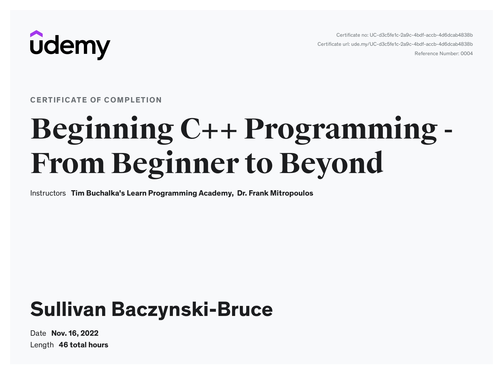
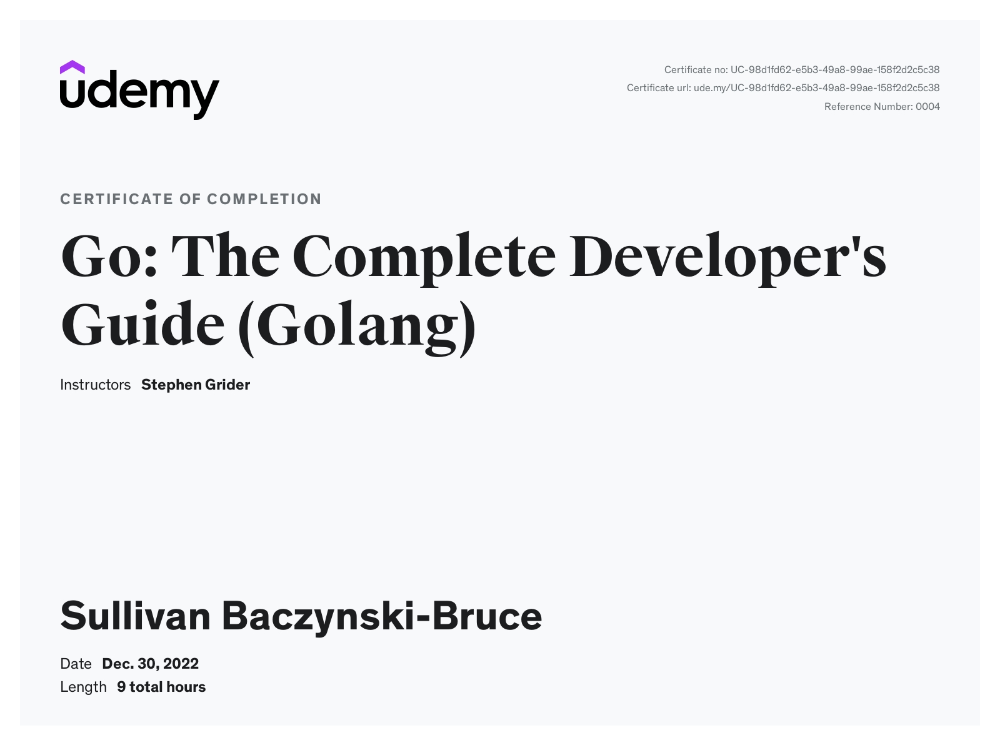
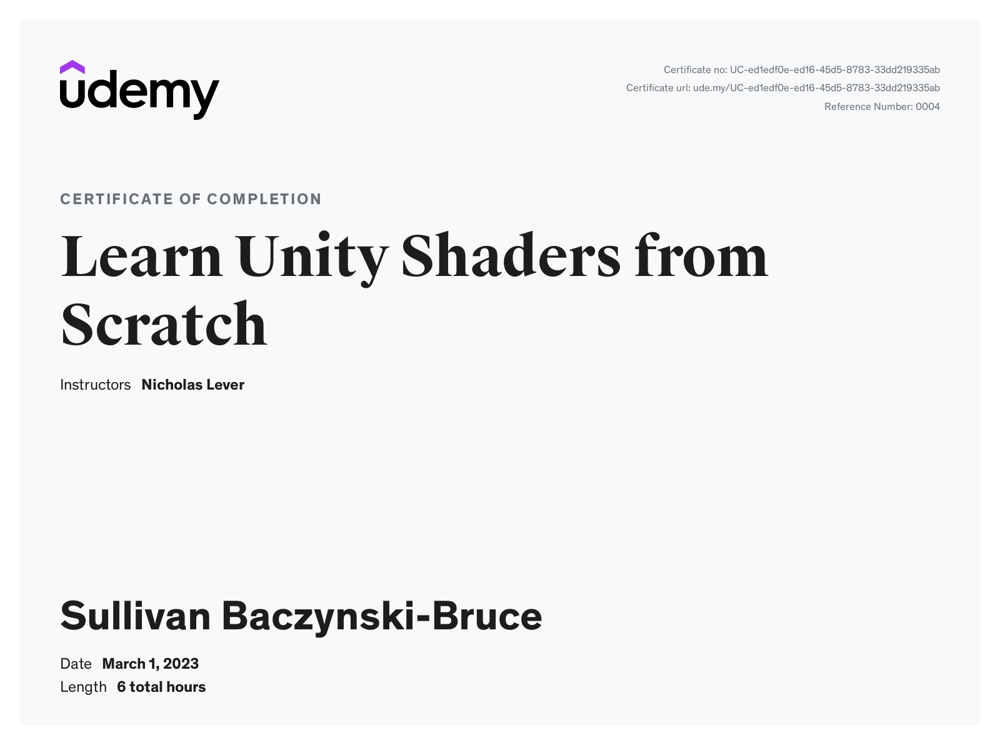
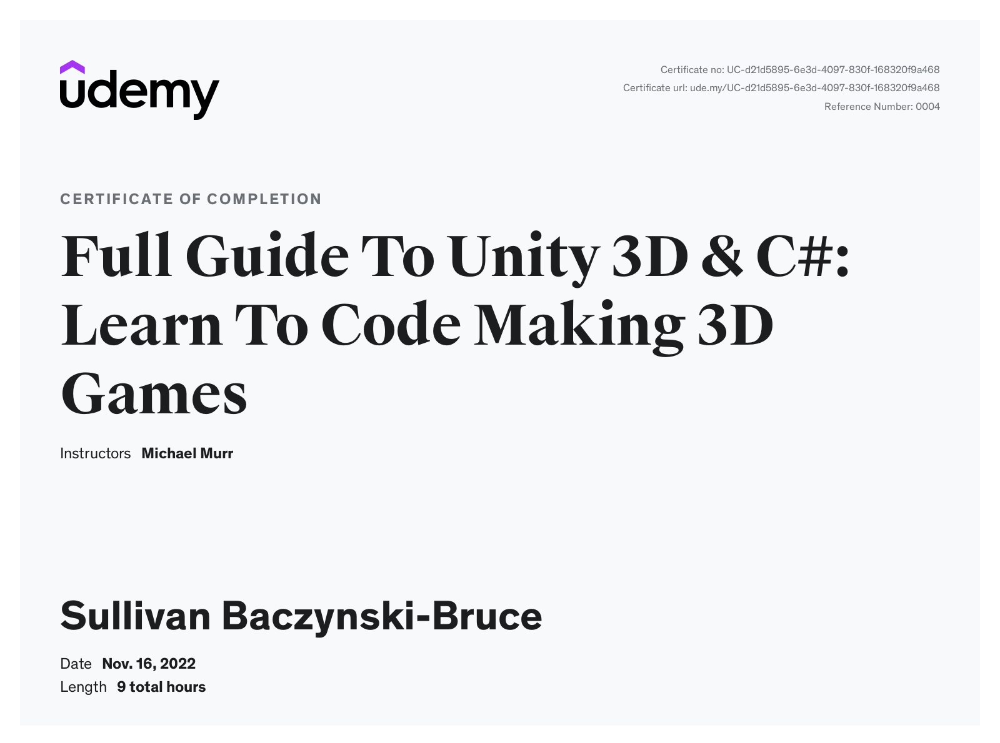
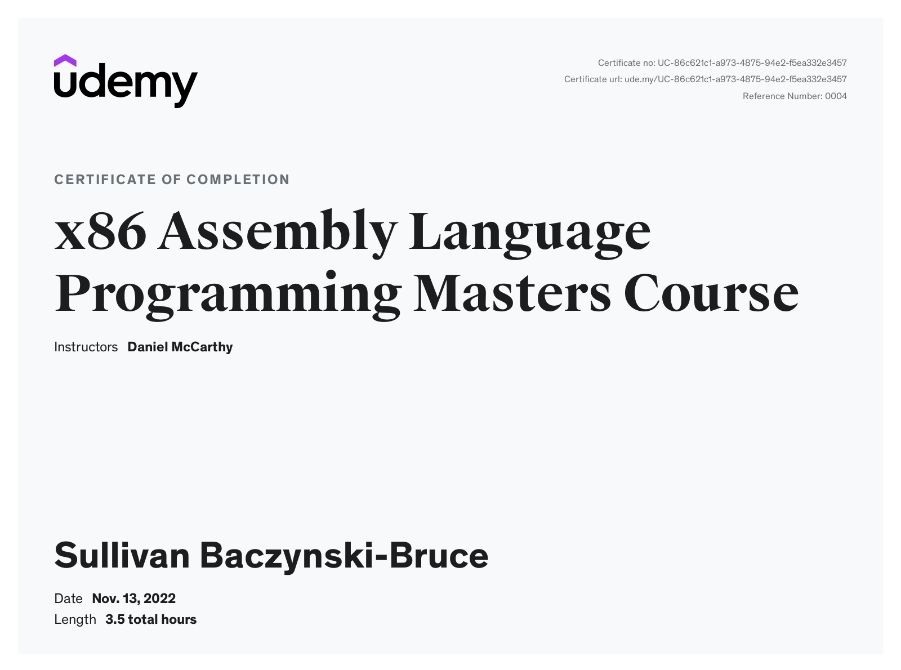

<!--
**Kayyo321/Kayyo321** is a ✨ _special_ ✨ repository because its `README.md` (this file) appears on your GitHub profile.

Here are some ideas to get you started:

- 🔭 I’m currently working on ...
- 🌱 I’m currently learning ...
- 👯 I’m looking to collaborate on ...
- 🤔 I’m looking for help with ...
- 💬 Ask me about ...
- 📫 How to reach me: ...
- 😄 Pronouns: ...
- ⚡ Fun fact: ...
-->

# Kayyo321 ⌨️
## s@koyak.net 👋

### About Me

United States computer science 

I have had started programming ever since COVID years ago, and have become very advanced in it since.
I'm very proficient in:
  * ✨ C/C++
  * ✨ Java
  * ✨ Python
  * ✨ Golang
  * ✨ x86 Assembly
  * ✨ Unreal Engine 5
  * ✨ Unity
  * (and more)
  
# Udemy certificates

Certificate of learning C/C++:

Certificate of learning Golang:

Certificate of learning HLSL:

Certificate of learning C# && Unity:

Certificate of learning x86 Assembly:

